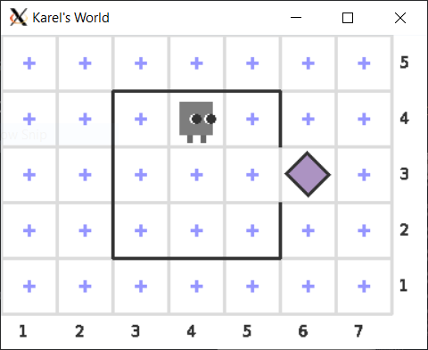
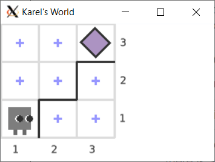
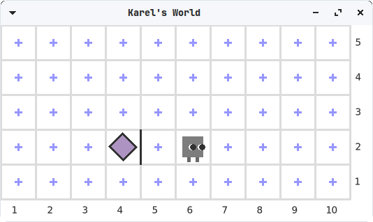

# Introduction to Karel the Robot

An overview of how to use Karel the Robot in C++.

## Who is Karel the Robot?

Karel the Robot is a gentle introductory programming language created by [Professor Richard Pattis](https://www.ics.uci.edu/~pattis/) in [*Karel the Robot: A Gentle Introduction to The Art of Programming*](https://www.google.com/books/edition/_/ghcZAQAAIAAJ?hl=en&gbpv=1) and implemented in C++ with his permission. The Karel language emphasizes logic while hiding tricky syntax, allowing anyone to begin making exciting graphical programs with very little background.

Below is a screenshot of little Karel standing in their two-dimensional world at the intersection of the 4th column and 4th row. They are facing east (right). Around them are walls, and there is a break in the walls that allows Karel to access a purple beeper.



Karel is a simple robot and only responds to four commands: they can move forward, turn left, put down a beeper or pick up a beeper. In addition, Karel is able to check state of the area around themselves. Karel cannot move through walls or off the edge of the world.

### Why are we using Karel?

> "By starting with Karel, you can concentrate on solving problems from the very beginning. Problem solving is the essence of programming. And because Karel encourages imagination and creativity, you can have quite a lot of fun along the way." -[Stanford's Karel Reader](https://compedu.stanford.edu/karel-reader/docs/java/en/chapter1.html)

Programs using Karel are true C++ programs but have a very limited scope, reducing the opportunities for novice programmers to run into tricky syntax and compiler errors.



## Setup

*You can follow this guide from your own machine, or try from [lab.cs50.io](https://lab.cs50.io/ILXL-guides/intro-to-karel). If you are not using CS50, you will see some markdown for cs50 using curly braces and percentage signs, which you can ignore.*

1. If you haven't used the command line before, start with the [command line treasure hunt](https://github.com/ILXL-guides/command-line-treasure-hunt/blob/master/README.md). This guide assumes some familiarity with terminal commands.

2. We'll need a reference to the ``Karel`` library:
```
git clone https://github.com/ILXL/cpputils
```

3. Now you can build Karel the Robot programs. We've provided a blank Karel program in ``main.cc``, and a ``Makefile`` that contains the build commands. Make sure you can build it and run it with these commands in the terminal:
```
make build
./main
```
  *CS50 Note: You do not need to edit the ``Makefile`` and can close that editor tab*

This should open a Karel's world in a window, which displays Karel in their grid with several walls and one beeper.

### Accessibility setup

There are methods to make Karel accessible for screen-reader users and those who need to control animation timing. Please see the [C++ Utils wiki](https://github.com/ILXL/cpputils/wiki/Karel-Accessibility).



## Understanding Karel's world

Karel lives in a two-dimensional world, where each cell in the grid can be identified by its vertical column and horizontal row. For example, the bottom-left cell is at column 1 and row 1, so we call it (1, 1). The next cell to the east from (1, 1) is (2, 1), i.e. the cell in the second column and first row.

Karel the Robot may occupy one cell at a time. In addition to a position, Karel has an orientation in the world: they may be facing north (up), east (towards the right edge), south (down), or west (towards the left edge).

In the example below, Karel is standing at cell (1, 1) and facing east. There is a beeper in the top right at (3, 3). Also we can see that there are a few walls in the world.



Although it's not drawn in the image, Karel has a bag of beepers. This bag may be empty or it may have beepers in it.

## Moving Karel

Karel can move through the world using two actions: they can ``Move();`` forward or ``TurnLeft();`` to rotate.

* The command ``Move();`` will move Karel forward one cell in the direction they are facing. If Karel cannot move forward, because they are blocked by a wall or an edge, the program will display an error.

* The command ``TurnLeft();`` will rotate Karel 90 degrees to the left (counter-clockwise).

### Your turn

In the file ``main.cc`` you can edit the ``KarelProgram()`` function to get Karel to move around their world. Try it: edit your ``KarelProgram()`` function to look like this:

```cpp
void KarelProgram() {
  Move();
}
```

Now see how this changes Karel by building and running again with:

```
make build
./main
```

Try adding a ``TurnLeft();``:
```cpp
void KarelProgram() {
  Move();
  TurnLeft();
}
```

Can you modify your Karel program to have Karel walk out the door of their house and stand on top of the beeper? Combine ``Move();`` and ``TurnLeft();`` commands until you have Karel in the right spot. If you need a hint you can look at the example below.



```cpp
void KarelProgram() {
  Move();
  Move();
  // It takes three left turns to make a right.
  TurnLeft();
  TurnLeft();
  TurnLeft();
  Move();
  TurnLeft();
  Move();
  // Should be on the beeper now!
}
```





## Interacting with Beepers

Karel is able to pick up beepers from the world and store them in their beeper bag with the command ``PickBeeper();``. They are also able to put beepers from their bag down into the world using the command ``PutBeeper();``

* The command ``PickBeeper();`` will cause Karel to pick up a beeper from the cell where they are standing. If they are not standing on a beeper this will result in an error.

* The command ``PutBeeper();`` will cause Karel to put down a beeper into the cell where they are standing, but this will result in an error if Karel doesn't have any beepers left in their bag.

### Your turn

Modify the ``KarelProgram()`` to pick up the beeper from outside Karel's house. Then, move Karel back to their starting cell at (3, 4) and put down the beeper.

Test your program with ``make build`` and ``./main`` from the command line. It's OK if you don't get it in the first try!



```cpp
void KarelProgram() {
  Move();
  Move();
  // It takes three left turns to make a right.
  TurnLeft();
  TurnLeft();
  TurnLeft();
  Move();
  TurnLeft();
  Move();
  // Should be on the beeper now!
  PickBeeper();
  TurnLeft();
  TurnLeft();
  Move();
  Move();
  Move();
  TurnLeft();
  TurnLeft();
  TurnLeft();
  Move();
  PutBeeper();
}
```





## Checking world and Karel conditions

In addition to the four commands discussed above, Karel can check the state of themself and their world. Karel is able to check whether or not there is a wall or edge to the front, left or right of where they are currently standing. They are able to check whether or not there are beepers in the cell where they are standing, and whether or not they have beepers in their bag. And they are able to check whether or not they are facing north, south, east or west.

Following are the conditions Karel knows about:

| Condition | Opposite | Meaning |
|-----------|----------|---------|
|`FrontIsClear();`|`FrontIsBlocked();`|Whether there is a wall or edge directly in front of Karel|
|`LeftIsClear();`|`LeftIsBlocked();`|Whether there is a wall or edge directly to Karel's left|
|`RightIsClear();`|`RightIsBlocked();`|Whether there is a wall or edge directly to Karel's right|
|`FacingNorth();`|`NotFacingNorth();`|Whether Karel is facing north (up)|
|`FacingEast();`|`NotFacingEast();`|Whether Karel is facing east (right)|
|`FacingSouth();`|`NotFacingSouth();`|Whether Karel is facing south (down)|
|`FacingWest();`|`NotFacingWest();`|Whether Karel is facing west (left)|
|`BeepersPresent();`|`NoBeepersPresent();`|Whether there is a beeper in the cell that Karel occupies|
|`HasBeepersInBag();`|`NoBeepersInBag();`|Whether Karel has any beepers in their bag|

*Note: Each of these functions returns the boolean value ``true`` or the boolean value ``false``.*

These conditions may be checked in ``while`` and ``if`` statements to help Karel make informed decisions about how to interact with their world.

### Your turn

Let's write a program to get Karel to clean up all the beepers in the row where y is 1.

If we knew ahead of time how many beepers were on each cell it would be easy to simply have Karel ``PickBeeper();`` and then ``Move();`` over and over. But in the world file ``worlds/CleanupBeepersKarel.w`` there may be more than one beeper on a cell, or none at all! Karel will need to use conditionals to decide when to remove a beeper and how many to remove.

First, edit the ``main()`` function in ``main.cc`` to load ``worlds/CleanupBeepersKarel.w`` instead of ``worlds/CollectNewspaperKarel.w``.

Then, replace the code in ``KarelProgram``.

Below is an example solution, but try it yourself before looking at this!



```cpp
void KarelProgram() {
  while (true) {
    while (BeepersPresent()) {
      PickBeeper();
    }
    if (FrontIsClear()) {
      Move();
    } else {
      return;
    }
  }
}

int main() {
  LoadWorld("worlds/CleanupBeepersKarel.w");
  KarelProgram();
  Finish();
  return 0;
}
```



### Extra challenge

Can you edit your program to clean up all the beepers in the world, not just those on the row where y is 1?

Can you do the same thing without hard-coding any integers - instead only using conditional statements and while loops?



## Programming challenges with Karel

TODO: add challenges allowing students to practice with Karel commands and conditionals.

## World building

Karel's worlds are generated by describing the grid in a text file (by convention, with a '.w' extension, and stored in the /worlds directory). This is a replica of the first puzzle in the original book about Karel:

The source file for FirstWorldKarel.w lays out Karel's location and direction, beeper(s), and wall:
```
Dimension: (10, 5)
Wall: (5, 2) west
Beeper: (4, 2) 1
Karel: (6, 2) east
Speed: 1.50
```
## Resources

[Karel Reader](https://compedu.stanford.edu/karel-reader/docs/java/en/chapter1.html): A similar tutorial from Stanford about Karel in Java.

[Karel the Robot learns Java](https://cs.stanford.edu/people/eroberts/karel-the-robot-learns-java.pdf): a guide to Karel from Stanford (in Java, but most concepts apply here, although our Karel is functional programming rather than object-oriented).
